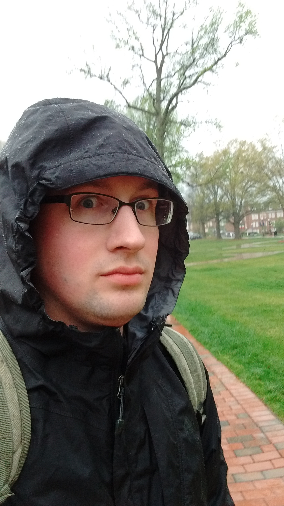

Hello again!

Call me Greg -- that last name is Polish and a bit of a mouthful (*Mlin-ar-check*)

I'm a researcher and teacher. My interests lie in the brain, specifically how trauma impacts plasticity and learning. Language development is also a passion of mine, but I'm less well read in that area.

Outside of work, I enjoy games and game design, as well as acting, improvisation, building electronics and tinkering with computers.

This website was forked from a framework generously developed by Ole Vik, and is hosted on GitHub pages. If you have any interest in setting up a similar webpage of your own I'd be happy to help guide you.

